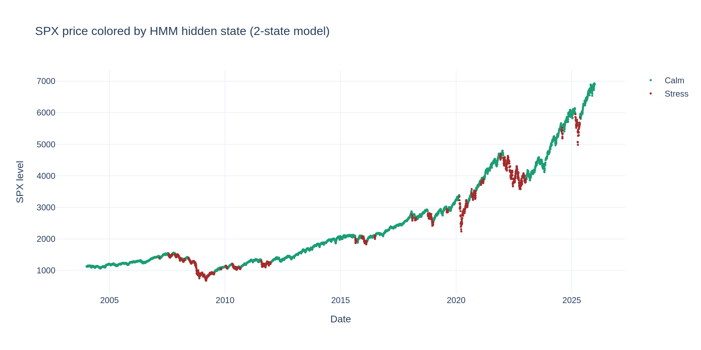
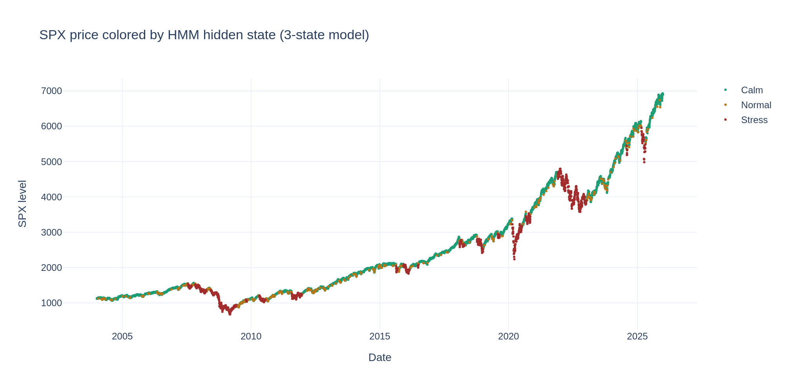

# HMM Regime Detection — Exploration

I use a Gaussian Hidden Markov Model to identify hidden market regimes from S&P 500
log returns. The idea: the market alternates between unobserved states (e.g. calm vs
stressed), and each state generates returns with different statistical properties
(mean, variance). The HMM learns both the transition dynamics between states and the
emission distribution of each state directly from the data, without arbitrary thresholds.

Plan:
1. Load data
2. Fit a 2-state HMM (univariate, SPX log returns)
3. Inspect estimated parameters (means, variances, transition matrix)
4. Visualize regimes over time, validate against known stress periods
5. Compare with a 3-state HMM
6. Model selection via AIC/BIC
7. (Optional) Change point detection as an alternative/complementary method


```python
import os
import sys
import numpy as np
import pandas as pd
import plotly.graph_objects as go
from hmmlearn import hmm
import warnings
warnings.filterwarnings("ignore", category = RuntimeWarning)

notebook_dir = os.getcwd()
parent_dir = os.path.dirname(notebook_dir)
sys.path.append(parent_dir)
from config_path import cfg_path
```

## 1. Load data


```python
df = pd.read_parquet(os.path.join(cfg_path.workspace_root, cfg_path.processed_data))
print(df.shape)

returns_series = df["^GSPC_log_ret"].dropna()
returns = returns_series.values.reshape(-1, 1)
dates = returns_series.index

print(f"Returns series: {returns.shape[0]} observations, from {dates.min().date()} to {dates.max().date()}")
```

    (5446, 61)
    Returns series: 5445 observations, from 2004-01-06 to 2025-12-30


## 2. Fit a 2-state Gaussian HMM

I start with the simplest meaningful case: two hidden states, interpretable as
"calm" and "stressed" regimes. `covariance_type="full"` lets each state have its own
variance (no shared-variance assumption across states), which is important here since
the whole point is that volatility differs by regime.
Note: hmmlearn prints a "Model is not converging" message during fit even when
`monitor_.converged` is True. This happens because the internal check flags any
log-likelihood decrease between iterations, however small — a common numerical
artifact near convergence with the EM algorithm, not a sign that the fit failed.


```python
model_2s = hmm.GaussianHMM(n_components=2, covariance_type="full", n_iter=1000, tol = 1e-3, random_state=42)
model_2s.fit(returns)

hidden_states_2s = model_2s.predict(returns)

print("Converged:", model_2s.monitor_.converged)
print("Log-likelihood:", model_2s.score(returns))
```

    Model is not converging.  Current: 17671.686154898543 is not greater than 17671.700590936707. Delta is -0.01443603816369432


    Converged: True
    Log-likelihood: 17671.635182363872


## 3. Inspect estimated parameters

I look at the mean and variance of returns in each state, and the transition matrix.
I expect one state to have a mean close to zero (or slightly positive) with low variance
(calm regime), and the other to have a more negative mean with high variance (stress regime).
The transition matrix tells us how persistent each regime is: high diagonal values mean
regimes tend to last, rather than flicker day to day.


```python
for state in range(2):
    mean = model_2s.means_[state][0]
    var = model_2s.covars_[state][0][0]
    std = np.sqrt(var)
    ann_vol = std * np.sqrt(252)
    n_days = (hidden_states_2s == state).sum()
    print(f"State {state}: mean={mean:.5f}, std={std:.5f}, annualized vol={ann_vol:.2%}, days={n_days} ({n_days/len(hidden_states_2s):.1%})")

print("\nTransition matrix:")
print(pd.DataFrame(model_2s.transmat_, columns=[f"to_state_{i}" for i in range(2)], index=[f"from_state_{i}" for i in range(2)]).round(4))

print("\nExpected duration per state (1 / (1 - p_self_transition)):")
for state in range(2):
    p_self = model_2s.transmat_[state, state]
    expected_duration = 1 / (1 - p_self)
    print(f"State {state}: expected duration = {expected_duration:.1f} days")
```

    State 0: mean=0.00086, std=0.00723, annualized vol=11.48%, days=4247 (78.0%)
    State 1: mean=-0.00155, std=0.02187, annualized vol=34.71%, days=1198 (22.0%)
    
    Transition matrix:
                  to_state_0  to_state_1
    from_state_0      0.9890      0.0110
    from_state_1      0.0394      0.9606
    
    Expected duration per state (1 / (1 - p_self_transition)):
    State 0: expected duration = 90.8 days
    State 1: expected duration = 25.4 days


## 4. Identify which state is "calm" vs "stressed"

The HMM does not label states for us — state 0 and state 1 are arbitrary indices.
I identify the high-volatility state as the one with the larger variance, and relabel
accordingly so the rest of the analysis is interpretable.


```python
variances = [model_2s.covars_[s][0][0] for s in range(2)]
stress_state = int(np.argmax(variances))
calm_state = int(np.argmin(variances))

state_labels = {calm_state: "Calm", stress_state: "Stress"}
print("State labels:", state_labels)

regime_series = pd.Series(hidden_states_2s, index=dates).map(state_labels)
```

    State labels: {0: 'Calm', 1: 'Stress'}


## 5. Visualize regimes over time

I overlay the decoded hidden state on the SPX price series. If the model is working as
expected, the "Stress" state should activate around the 2008 financial crisis, the
March 2020 COVID crash, and possibly the 2022 rate-hike/energy-crisis period.


```python
spx_aligned = df.loc[dates, "^GSPC"]

fig = go.Figure()
colors = {"Calm": "#1D9E75", "Stress": "#A32D2D"}

for label in ["Calm", "Stress"]:
    mask = regime_series == label
    fig.add_trace(go.Scatter(
        x=dates[mask], y=spx_aligned[mask],
        mode="markers", name=label,
        marker=dict(color=colors[label], size=3)
    ))

fig.update_layout(
    title="SPX price colored by HMM hidden state (2-state model)",
    template="plotly_white", height=500,
    yaxis_title="SPX level", xaxis_title="Date"
)
fig.show()
```


    

    


## 6. Cross-check against the rule-based regime flags from feature engineering

In `02_features.py` I built simple rule-based flags (`high_vol_regime` based on VIX > 25,
`bear_market_flag` based on the 200-day moving average). I compare these against what the
HMM found independently, as a sanity check — strong overlap would support the model's
validity; large discrepancies would be worth investigating.


```python
comparison = pd.DataFrame({
    "hmm_stress": (regime_series == "Stress").astype(int),
    "high_vol_regime": df.loc[dates, "high_vol_regime"],
    "bear_market_flag": df.loc[dates, "bear_market_flag"]
})

print("Overlap (% of days where both flags agree):")
print(f"HMM stress vs high_vol_regime: {(comparison['hmm_stress'] == comparison['high_vol_regime']).mean():.1%}")
print(f"HMM stress vs bear_market_flag: {(comparison['hmm_stress'] == comparison['bear_market_flag']).mean():.1%}")

print("\nCross-tab — HMM stress vs high_vol_regime:")
print(pd.crosstab(comparison["hmm_stress"], comparison["high_vol_regime"]))
```

    Overlap (% of days where both flags agree):
    HMM stress vs high_vol_regime: 90.5%
    HMM stress vs bear_market_flag: 89.5%
    
    Cross-tab — HMM stress vs high_vol_regime:
    high_vol_regime     0    1
    hmm_stress                
    0                4162   85
    1                 431  767


## 7. Try a 3-state HMM

Two states force a binary view of the world. I test whether a third state — an
intermediate "normal volatility" regime between calm and acute stress — better captures
the data, which would align with how practitioners typically think about market regimes
(low / medium / high volatility).


```python
model_3s = hmm.GaussianHMM(n_components=3, covariance_type="full", n_iter=1000, random_state=42)
model_3s.fit(returns)
hidden_states_3s = model_3s.predict(returns)

variances_3s = [model_3s.covars_[s][0][0] for s in range(3)]
order = np.argsort(variances_3s)
labels_3s = {order[0]: "Calm", order[1]: "Normal", order[2]: "Stress"}

for state in range(3):
    mean = model_3s.means_[state][0]
    std = np.sqrt(model_3s.covars_[state][0][0])
    ann_vol = std * np.sqrt(252)
    n_days = (hidden_states_3s == state).sum()
    print(f"State {state} ({labels_3s[state]}): mean={mean:.5f}, ann_vol={ann_vol:.2%}, days={n_days} ({n_days/len(hidden_states_3s):.1%})")
```

    Model is not converging.  Current: 17729.099542653457 is not greater than 17729.101342477134. Delta is -0.0017998236762650777


    State 0 (Calm): mean=0.00121, ann_vol=10.16%, days=3988 (73.2%)
    State 1 (Normal): mean=-0.00134, ann_vol=19.98%, days=302 (5.5%)
    State 2 (Stress): mean=-0.00173, ann_vol=38.58%, days=1155 (21.2%)


I overlay the 3-state decoding on the SPX price series, using the same visualization
approach as the 2-state model, to inspect whether the additional "Normal" state
captures a meaningful intermediate regime rather than just splitting noise.


```python
regime_series_3s = pd.Series(hidden_states_3s, index=dates).map(labels_3s)

fig = go.Figure()
colors_3s = {"Calm": "#1D9E75", "Normal": "#BA7517", "Stress": "#A32D2D"}

for label in ["Calm", "Normal", "Stress"]:
    mask = regime_series_3s == label
    fig.add_trace(go.Scatter(
        x=dates[mask], y=spx_aligned[mask],
        mode="markers", name=label,
        marker=dict(color=colors_3s[label], size=3)
    ))

fig.update_layout(
    title="SPX price colored by HMM hidden state (3-state model)",
    template="plotly_white", height=500,
    yaxis_title="SPX level", xaxis_title="Date"
)
fig.show()
```


    

    


**Observations:**
- The "Stress" state (21% of days) appears concentrated around 2008, March 2020, and parts
  of 2022 — consistent with known market crises and aligned with the 2-state model's findings.
- The "Normal" state is rare (5.5% of days) and appears mostly as short transitional periods
  between Calm and Stress, rather than a persistent regime of its own.
- This raises a question for the model selection step: does the 3-state model add genuine
  insight, or is "Normal" mostly capturing noise / transition days? AIC/BIC comparison below
  should help clarify this.

## 8. Model selection: how many states?

I compare models with 2, 3, 4, and 5 states using AIC and BIC. Both penalize model complexity
(more states = more parameters), trading off against log-likelihood (goodness of fit).
Lower is better for both criteria. BIC penalizes complexity more heavily than AIC, so the
two can disagree — I look at both rather than relying on a single number, and weigh the
result against interpretability (an 8-state model might win on BIC but be useless to
explain to a stakeholder).


```python
def n_params(n_states):
    # transition matrix (n*(n-1)) + means (n) + variances (n) + initial probs (n-1)
    return n_states * (n_states - 1) + n_states + n_states + (n_states - 1)

results = []
for n_states in [2, 3, 4, 5]:
    m = hmm.GaussianHMM(n_components=n_states, covariance_type="full", n_iter=1000, random_state=42)
    m.fit(returns)
    log_likelihood = m.score(returns)
    k = n_params(n_states)
    n_obs = len(returns)
    aic = 2 * k - 2 * log_likelihood
    bic = k * np.log(n_obs) - 2 * log_likelihood
    results.append({"n_states": n_states, "log_likelihood": log_likelihood, "aic": aic, "bic": bic})

pd.DataFrame(results).set_index("n_states")
```

    Model is not converging.  Current: 17671.686154898543 is not greater than 17671.700590936707. Delta is -0.01443603816369432
    Model is not converging.  Current: 17729.099542652464 is not greater than 17729.101342477796. Delta is -0.001799825331545435
    Model is not converging.  Current: 17935.33897446337 is not greater than 17935.43246215532. Delta is -0.09348769194912165
    Model is not converging.  Current: 17697.969140795165 is not greater than 17697.98242075973. Delta is -0.013279964565299451


<div>
<style scoped>
    .dataframe tbody tr th:only-of-type {
        vertical-align: middle;
    }

    .dataframe tbody tr th {
        vertical-align: top;
    }

    .dataframe thead th {
        text-align: right;
    }
</style>
<table border="1" class="dataframe">
  <thead>
    <tr style="text-align: right;">
      <th></th>
      <th>log_likelihood</th>
      <th>aic</th>
      <th>bic</th>
    </tr>
    <tr>
      <th>n_states</th>
      <th></th>
      <th></th>
      <th></th>
    </tr>
  </thead>
  <tbody>
    <tr>
      <th>2</th>
      <td>17671.635182</td>
      <td>-35329.270365</td>
      <td>-35283.053193</td>
    </tr>
    <tr>
      <th>3</th>
      <td>17729.078070</td>
      <td>-35430.156139</td>
      <td>-35337.721797</td>
    </tr>
    <tr>
      <th>4</th>
      <td>17935.162727</td>
      <td>-35824.325455</td>
      <td>-35672.469035</td>
    </tr>
    <tr>
      <th>5</th>
      <td>17697.928214</td>
      <td>-35327.856429</td>
      <td>-35103.373026</td>
    </tr>
  </tbody>
</table>
</div>


**Conclusions:**
- AIC and BIC both favor the 4-state model, with a clear improvement over 2 and 3 states.
- The 5-state model performs worse than the 4-state one on both criteria, and likely
  reflects an unstable fit (larger convergence delta), suggesting the extra state does
  not capture genuine structure in the data.
- Given the interpretability trade-off, I proceed with the 3-state model for the main
  analysis (Calm / Normal / Stress), as it offers a clean, communicable regime structure
  consistent with how practitioners typically describe volatility regimes. The 4-state
  model is noted as a stronger statistical fit and could be revisited later (e.g. splitting
  "Stress" into moderate and acute sub-regimes).
